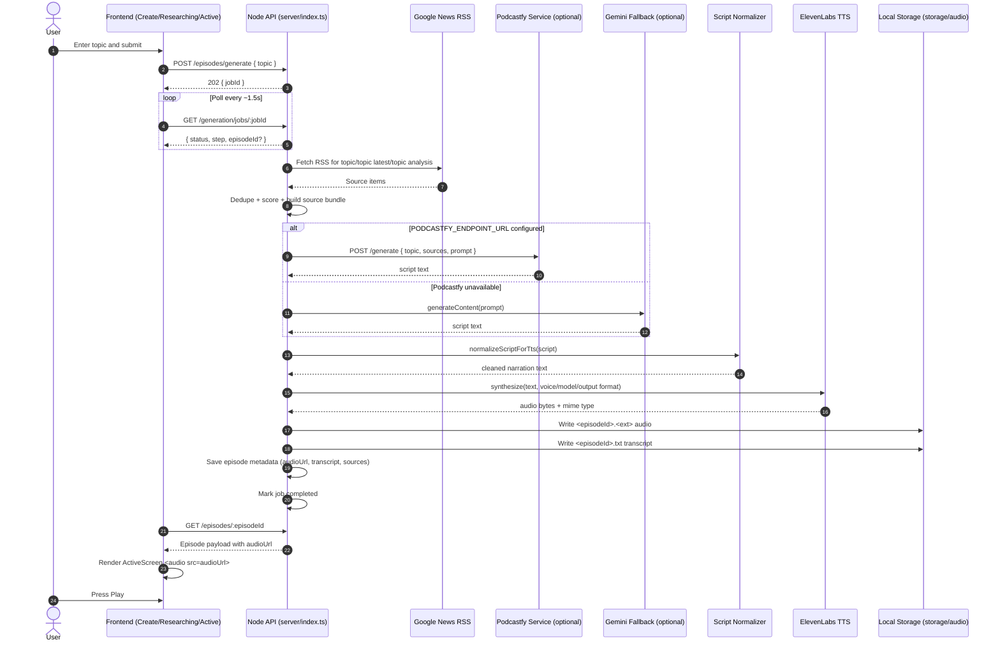

# Radio Presto V1 End-to-End Audio Generation Flow

This document describes the real V1 runtime flow from user topic input to generated audio playback.

## 1. Technical Actors

Client-side actors:
- User (browser)
- `CreateScreen` (`src/components/screens/CreateScreen.tsx`) topic input UI
- `App.tsx` state orchestrator (`handleStartResearch`, `handleGenerationCompleted`)
- API client (`src/lib/api.ts`)
- `ResearchingScreen` polling job progress (`GET /generation/jobs/:jobId`)
- `ActiveScreen` HTML audio playback (`src/components/screens/ActiveScreen.tsx`)

Backend actors (Node API):
- Express API server (`server/index.ts`)
- Job state store (`jobs` in-memory map)
- Episode store (`episodes` in-memory map)
- Source collector (Google News RSS fetch + parse)
- Source ranker/builder (`buildSourceBundle`)
- Script generator orchestrator (`runPodcastfyScriptGeneration`)
- TTS normalization layer (`server/services/tts/normalize.ts`)
- TTS abstraction (`server/services/tts/types.ts`, `server/services/tts/provider.ts`)
- ElevenLabs provider (`server/services/tts/elevenlabs.ts`)
- ElevenLabs config loader (`server/config/elevenlabs.ts`)
- Media persistence (`storage/audio`, served by `app.use("/media", express.static(...))`)

Optional/External actors:
- Podcastfy microservice (`services/podcastfy_api/main.py`) via `PODCASTFY_ENDPOINT_URL`
- Gemini model fallback (`@google/genai`) if Podcastfy endpoint is absent/unavailable
- ElevenLabs API (TTS)
- Google News RSS endpoints (source ingestion)

## 2. End-to-End Sequence

1. User enters a topic in Create screen and submits.
2. Frontend calls `POST /episodes/generate` with `{ topic }`.
3. Backend creates a generation job (`pending` -> `running`) and returns `202 { jobId }`.
4. Frontend navigates to `ResearchingScreen` and polls `GET /generation/jobs/:jobId` every ~1.5s.
5. Backend step `collecting_sources`:
- Queries Google News RSS for `topic`, `topic latest`, `topic analysis`.
- Parses RSS items into source candidates.
- Deduplicates by normalized URL key.
6. Backend step `building_bundle`:
- Scores sources (topic relevance + metadata availability).
- Selects top sources for the source bundle.
7. Backend step `generating_episode`:
- Builds a narration prompt from topic + source bundle.
- Calls Podcastfy endpoint (`PODCASTFY_ENDPOINT_URL`) when configured.
- Falls back to Gemini when Podcastfy response is unavailable.
- Falls back to deterministic local text as last resort.
8. Backend script normalization:
- Trims and cleans markdown artifacts.
- Strips leaked planning/scratchpad text patterns before TTS.
- Fails job if no valid narration remains.
9. Backend step `finalizing`:
- Invokes TTS provider interface (`createTtsProvider().synthesize(...)`).
- Current provider is ElevenLabs.
- Sends normalized narration text + configured voice/model/output format.
10. ElevenLabs returns audio bytes.
11. Backend persists artifacts:
- Writes audio file to `storage/audio/<episodeId>.<ext>`.
- Writes transcript text to `storage/audio/<episodeId>.txt`.
- Creates episode metadata with `audioUrl`, `audioMimeType`, `transcript`, `sources`.
12. Backend marks job `completed` with `episodeId`.
13. Polling frontend sees completion and fetches `GET /episodes/:episodeId`.
14. Frontend stores returned episode and switches to Active screen.
15. `ActiveScreen` renders `<audio>` with backend `audioUrl` and plays real generated audio.

## 3. API Contract Touchpoints

Generation start:
- `POST /episodes/generate`
- Response: `{ jobId }`

Generation status:
- `GET /generation/jobs/:jobId`
- Response: `{ id, status, step, errorMessage?, episodeId? }`

Episode fetch:
- `GET /episodes/:episodeId`
- Response includes: `id`, `topic`, `title`, `summary`, `transcript`, `audioUrl`, `audioMimeType`, `durationSeconds?`, `createdAt`, `sources[]`

## 4. Environment/Configuration Actors

Required for TTS:
- `ELEVENLABS_API_KEY`

Optional TTS tuning:
- `ELEVENLABS_VOICE_ID`
- `ELEVENLABS_MODEL_ID`
- `ELEVENLABS_OUTPUT_FORMAT`
- `ELEVENLABS_BASE_URL`

Script generation routing:
- `PODCASTFY_ENDPOINT_URL` (preferred script-generation path)
- `GEMINI_API_KEY` (fallback script-generation path)

Server runtime:
- `API_PORT`

## 5. Failure Paths (High Level)

- Missing/invalid topic -> `400` at generation start.
- No sources or low-quality bundle -> job `failed` with error message.
- Podcastfy/Gemini script failure -> job `failed`.
- Script normalization removes all content (prompt leakage only) -> job `failed`.
- ElevenLabs config error (missing API key) -> job `failed`.
- ElevenLabs API/network/empty-audio error -> job `failed`.
- Audio file write failure -> job `failed`.
- Frontend playback failure (invalid URL/MIME/network) -> Active screen shows playback error.

## 6. V1 Boundaries

Included in this flow:
- One topic input
- One generated episode
- One TTS voice path (ElevenLabs)
- Single audio artifact returned as `audioUrl`

Out of scope in V1:
- Auth
- Queue orchestration
- Multi-episode planning
- Music integration
- Voice selection UI

## 7. Mermaid Sequence Diagram

